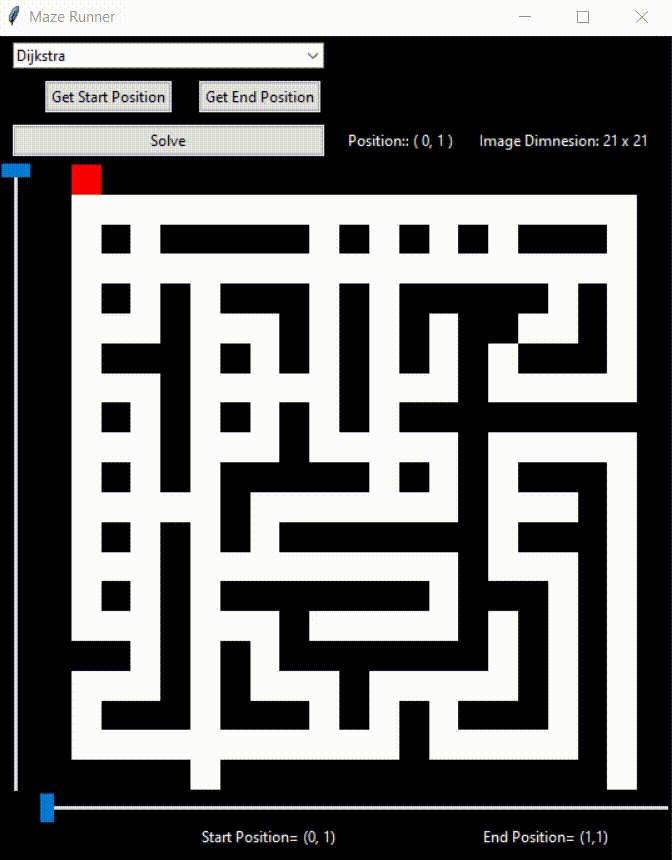
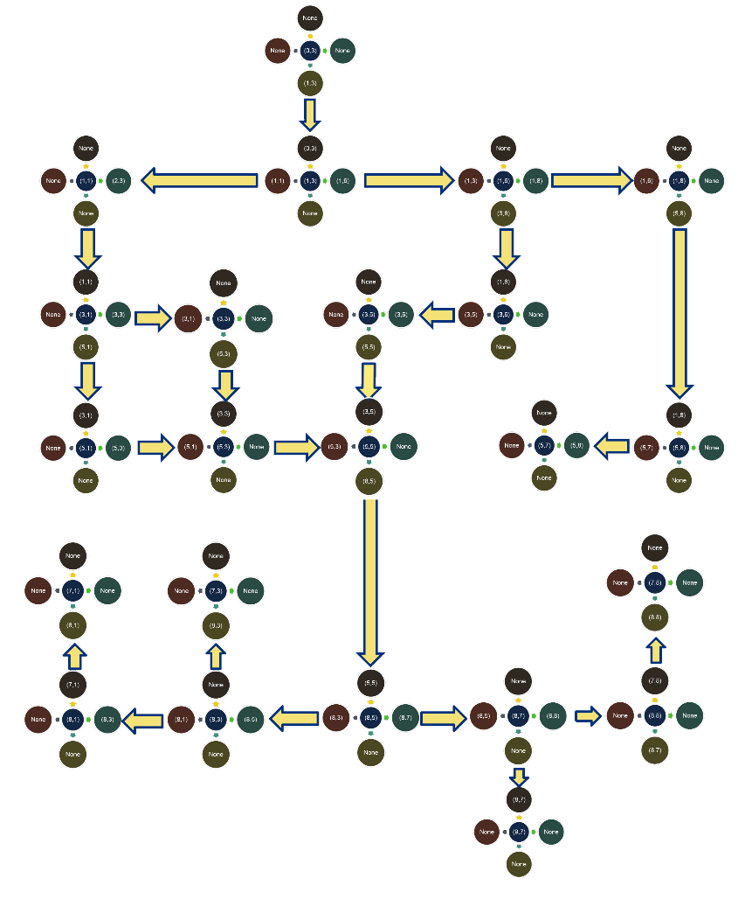
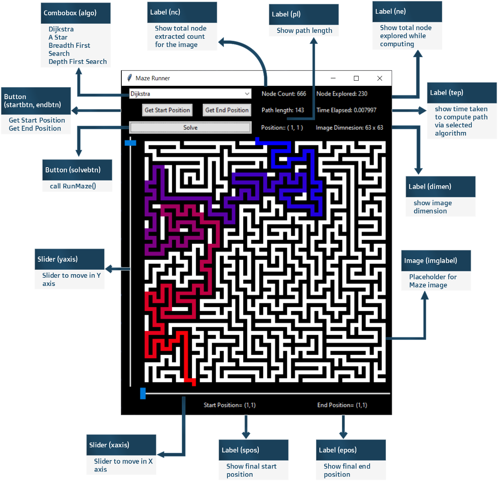

# Maze-Runner
Maze Runner is based on Travelling Salesman Problem, to minimize the travelling cost to find the best possible solution. The user input maze image of m x n dimension which is converted to a graph, extracting the nodes and making connections which is used to traverse the maze via different algorithms. So, the user can compare different algorithms to get the most efficient path, while generating nodes in a graph. The maze can be a source to find the shortest easy path, from the multiple path that leads to the solution.
TSP Problem is one of the complex, where multiple solution paths can be found, but not every solution is a good solution. We would require efficient and well-defined algorithms to extract and generate shortest paths to reach our destination node.
Algorithms involved in this project are Breadth First Search, Depth First Search, Dijkstra, and A-Star, can be used to explore and traverse through the shortest path possible.   
After traversal with each algorithm, we compare the result with each, and find the most the best solutions we get in terms of path length, path explored, and time elapsed.

### Proposed Work

Firstly, let us talk about the Image constraints which is to be loaded on to the application for processing. Image should be a Black and White (2D Matrix) image. Initially the image will have a non-RGB value.
Here, every pixel denotes 1- white and 0- black (1 for Black and 0 for White).
The maze is divided into portions, where each pixel can represent a path or wall. The exterior of the maze is covered with walls, with a single entry and exit points.
After image gets loaded into the application, then we analyze the image for node generation. The image is analyzed or extracted in a row-wise manner, initially starting from the left-most node of the image. The path where there are no juncture, will contain no nodes, but at a junction point and at the end part of each leading path, nodes are generated. Now, combining all these nodes, we get a graph that can be traversed. All these nodes will be connected, as they were analyzed in image, giving a resultant graph.
We store the visited nodes in memory, which will later help in backtracking and removing ambiguity and avoid deadlock situations during traversal. 

The user will interact using an intuitive GUI, which will allow user to view the maze image. Along with slider movement to select starting position and end position in the maze image, to get the path. The user also selects the algorithm using which the maze has to be solved. 

The application will use 4 algorithms to solve the maze:

1) Breadth First Search
2) Depth First Search
3) A-Star (A *)
4) Dijkstra